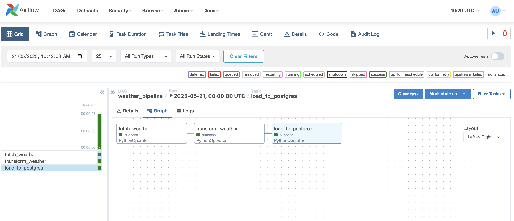

# Weather Data Pipeline with Apache Airflow

A scalable, containerized data pipeline built using Apache Airflow to automate the extraction, transformation, and loading (ETL) of weather data into a PostgreSQL database.

---

## Project Overview

This project demonstrates the design and implementation of a modular ETL workflow to fetch real-time weather data, process it, and persist it in a database for downstream analysis or reporting.

- **ETL Pipeline with Airflow:** A Directed Acyclic Graph (DAG) with three Python tasks — fetching data from the OpenWeatherMap API, transforming the raw data, and loading it into PostgreSQL.
- **Containerized Environment:** Docker and Docker Compose orchestrate Airflow components and the PostgreSQL database, ensuring portability and ease of deployment.
- **Python 3.9 & LocalExecutor:** Tasks run using Airflow’s LocalExecutor for parallel execution while maintaining a low resource footprint.

---

## Technologies & Tools

- Apache Airflow 2.6.3 (Python 3.9)
- PostgreSQL 15
- Docker & Docker Compose
- Python libraries: `requests`, `psycopg2-binary`
- OpenWeatherMap API for live weather data

---

## DAG Visualization

The workflow graph for the `weather_pipeline` DAG is included in this repository as `dag_graph.png`.

---

## Additional Notes

- The use of Docker ensures consistent environments across machines.
- LocalExecutor is used to balance task parallelism with system resource constraints.
- Ensure sensitive credentials are managed securely in production environments.

---

Feel free to explore the code, suggest improvements, or raise issues!

